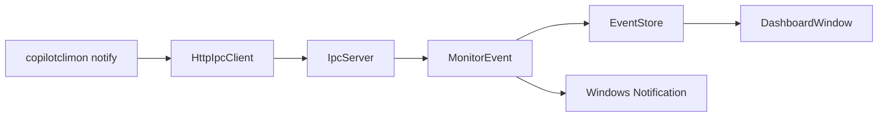
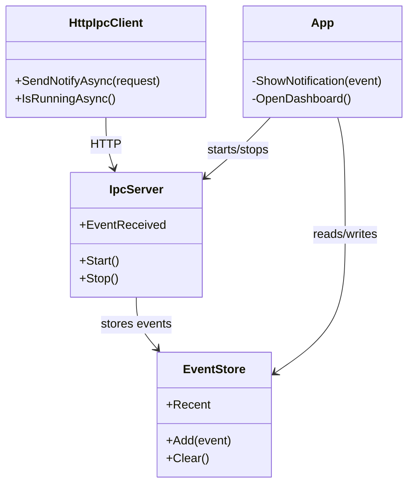

# API documentation

This document summarizes key public APIs in the core library and app integration surface.

## Core models

| Type | Purpose |
|---|---|
| `MonitorEvent` | Normalized event payload used by app and CLI paths |
| `NotifyRequest` | IPC/CLI request contract (`event`, `message`, `repository`, `branch`) |
| `NotifyResponse` | IPC response contract (`success`, optional `error`) |
| `EventType` | Known event classification enum |

## Core interfaces

| Interface | Key members |
|---|---|
| `IIpcClient` | `SendNotifyAsync()`, `IsRunningAsync()` |
| `IEventNotifier` | `NotifyAsync()` |
| `IEventStore` | `Add()`, `Clear()`, `Recent` |
| `IRepositoryDetector` | `DetectRepositoryRoot()` |

## Core services

| Class | Role |
|---|---|
| `HttpIpcClient` | Sends health/notify requests to local monitor |
| `EventStore` | Thread-safe bounded queue of recent events |
| `HookInstaller` | Creates repository hook scripts and config files |
| `LoggingFactoryBuilder` | Builds structured console + rotating file logger factory |

## App services

| Class | Role |
|---|---|
| `IpcServer` | Local HTTP listener for event ingestion |
| `ProtectedTokenStore` | DPAPI-backed token persistence |
| `UserPreferencesStore` | Local preferences persistence |
| `UserTelemetryClient` | Optional local anonymous telemetry sink |

## High-level flow

## Class relationship sketch

